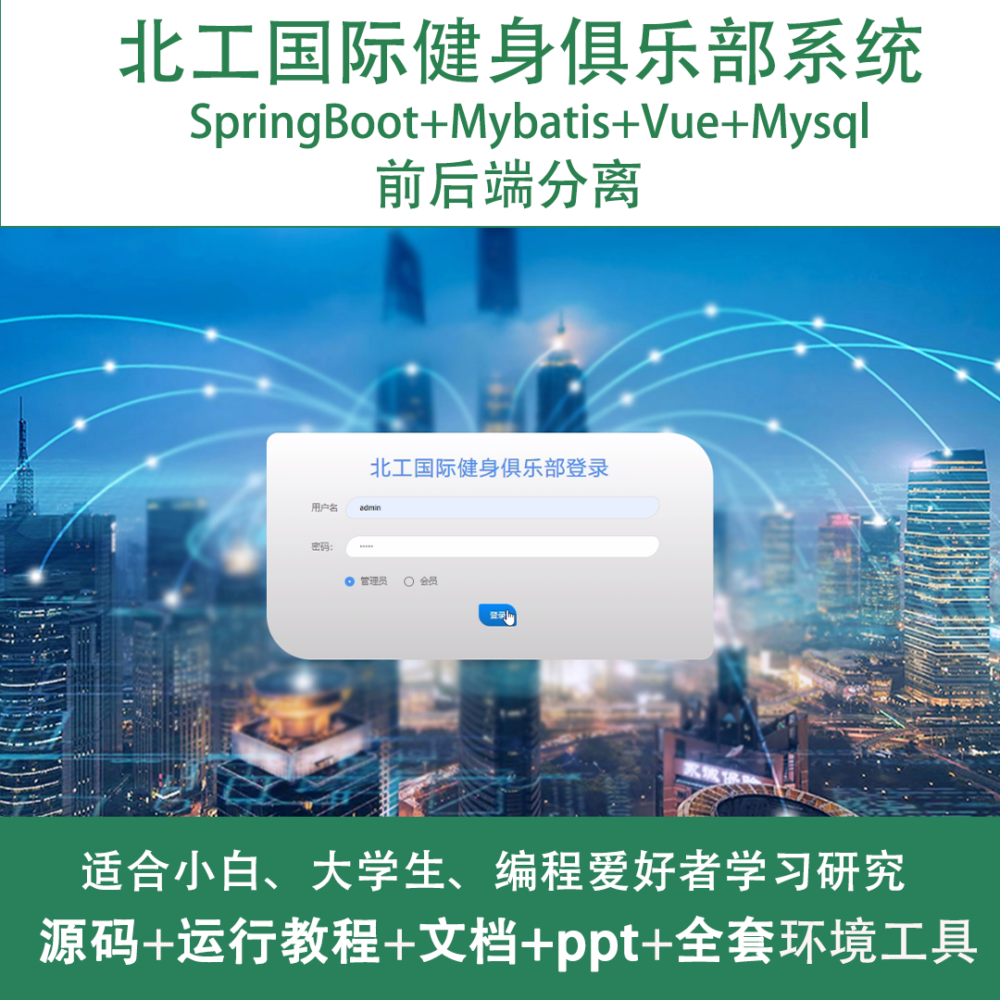
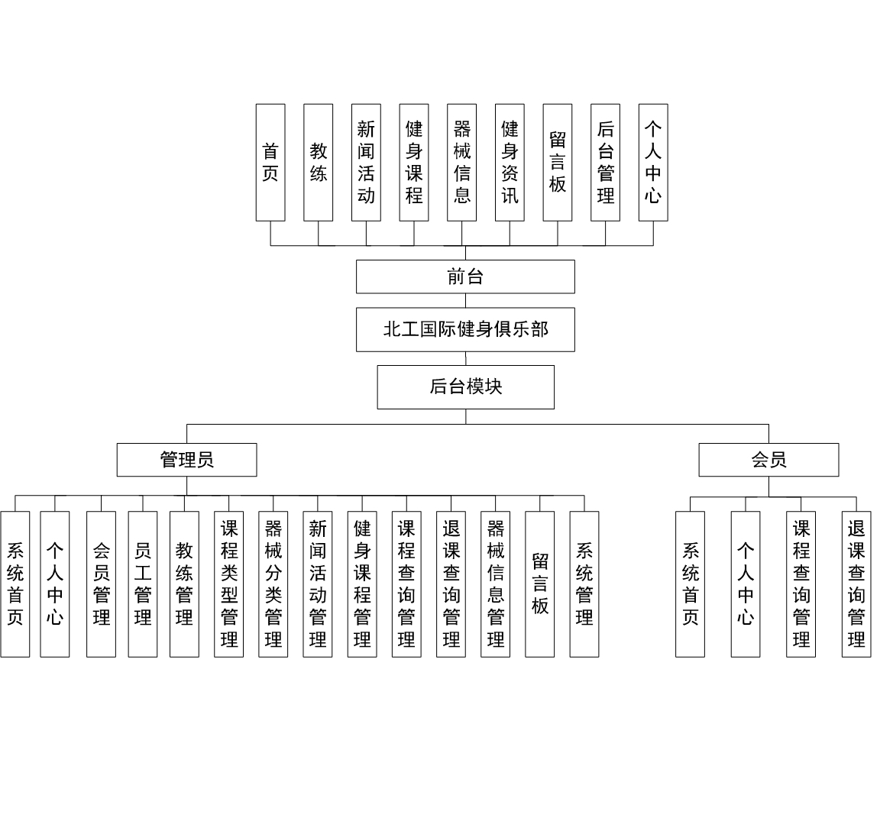
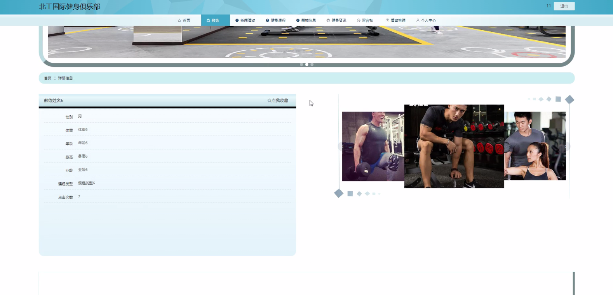
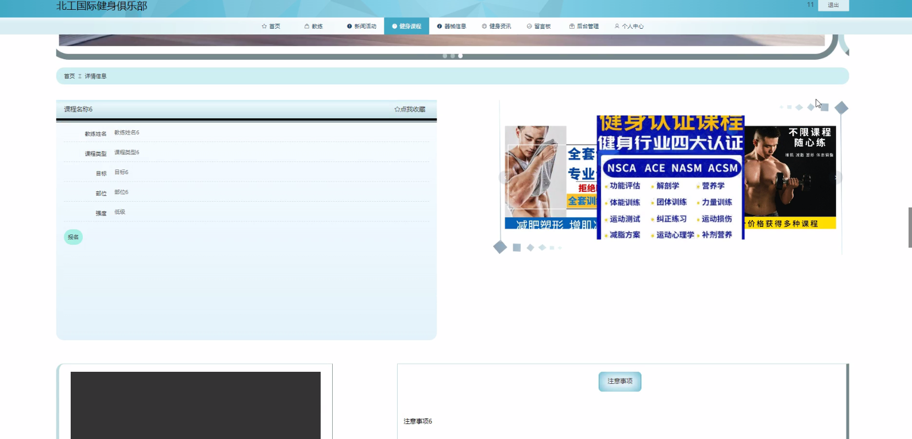
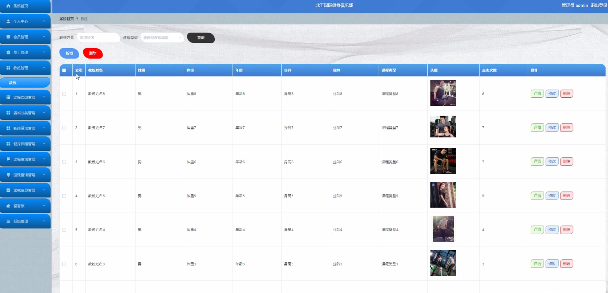
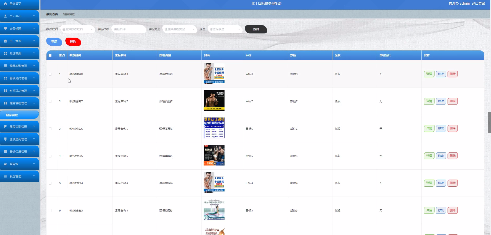
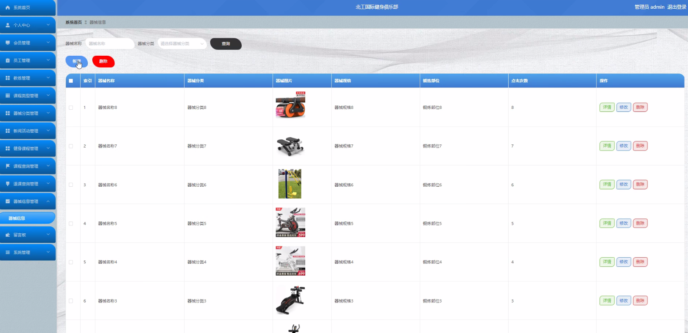
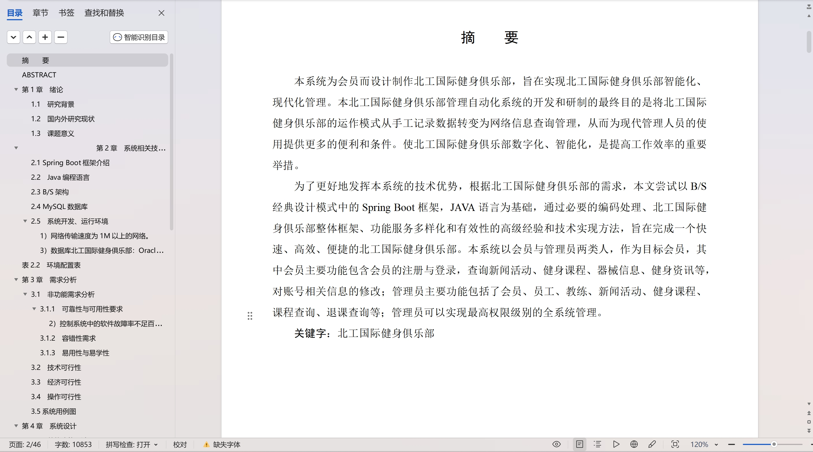

 
## 查看主页获取源码

> **作者介绍**： **✌**全网粉丝10W+本平台特邀作者、博客专家、CSDN新星计划导师、java领域优质创作者,博客之星、掘金/华为云/阿里云/InfoQ等平台优质作者、专注于项目实战 **✌**

  

### 一、作品包含

源码+数据库+设计文档万字+PPT+全套环境和工具资源+部署教程

### 二、项目技术

前端技术：Html、Css、Js、Vue、Element-ui

数据库：MySQL

后端技术：Java、Spring Boot、MyBatis

  

### 三、运行环境

开发工具：IDEA/eclipse

数据库：MySQL5.7

数据库管理工具：Navicat10以上版本

环境配置软件： JDK1.8+Maven3.6.3

前端Nodejs：14

### 四、项目介绍
项目编号：springbootA087

北工国际健身俱乐部整体框架、功能服务多样化和有效性的高级经验和技术实现方法，旨在完成一个快速、高效、便捷的北工国际健身俱乐部。本系统以会员与管理员两类人，作为目标会员，其中会员主要功能包含会员的注册与登录，查询新闻活动、健身课程、器械信息、健身资讯等，对账号相关信息的修改；管理员主要功能包括了会员、员工、教练、新闻活动、健身课程、课程查询、退课查询等；管理员可以实现最高权限级别的全系统管理

### 五、运行截图

  
